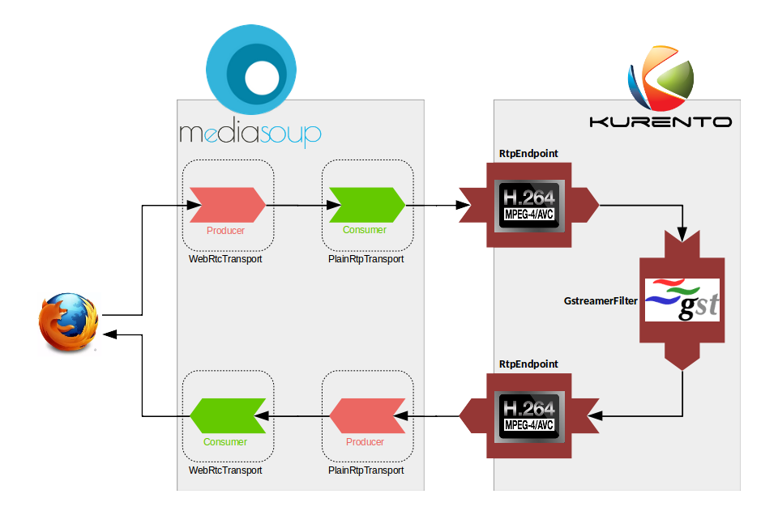

# mediasoup demo - Kurento filter integration

In this example, a browser's webcam media is transmitted to [mediasoup](https://mediasoup.org/) using WebRTC ([WebRtcTransport](https://mediasoup.org/documentation/v3/mediasoup/api/#WebRtcTransport)); it is then served as a plain RTP stream ([PlainTransport](https://mediasoup.org/documentation/v3/mediasoup/api/#PlainTransport)) to be received and processed by [Kurento](https://www.kurento.org/) ([RtpEndpoint](https://doc-kurento.readthedocs.io/en/stable/_static/client-jsdoc/module-elements.RtpEndpoint.html)).

Kurento will apply a greyscale filter to the incoming video ([GStreamerFilter](https://doc-kurento.readthedocs.io/en/stable/_static/client-jsdoc/module-filters.GStreamerFilter.html)), and the result will be sent back to mediasoup for presentation.

Check out the architecture diagram of this demo:



## Setup

mediasoup applications are written for [Node.js](https://nodejs.org/), so you need to have it installed. Follow the [installation instructions](https://github.com/nodesource/distributions/blob/master/README.md) provided by NodeSource to install Node.js from an official repository; or just grab it from the official [downloads page](https://nodejs.org/en/download/).

This demo shows how to integrate mediasoup with Kurento Media Server, so the later must be installed too. Just follow the [Kurento installation instructions](https://doc-kurento.readthedocs.io/en/stable/user/installation.html#local-installation).

**Note that Kurento is only compatible with either Ubuntu 16.04 (Xenial) or 18.04 (Bionic)**.


## Run

Run these commands:

```sh
sudo service kurento-media-server start

npm install

npm start
```

Then wait for a message such as `Web server is listening on https://localhost:8080`, and direct your browser to that URL.
